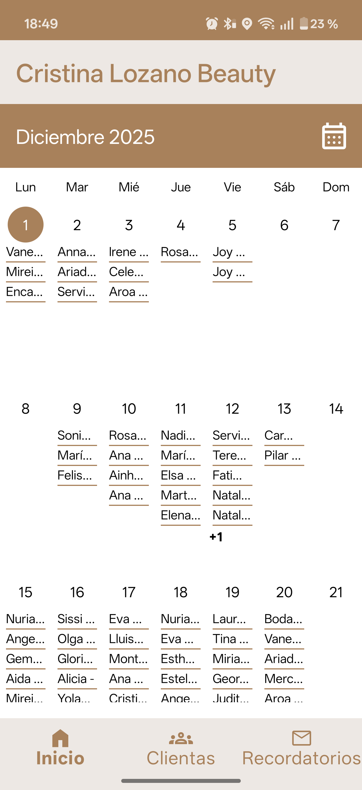
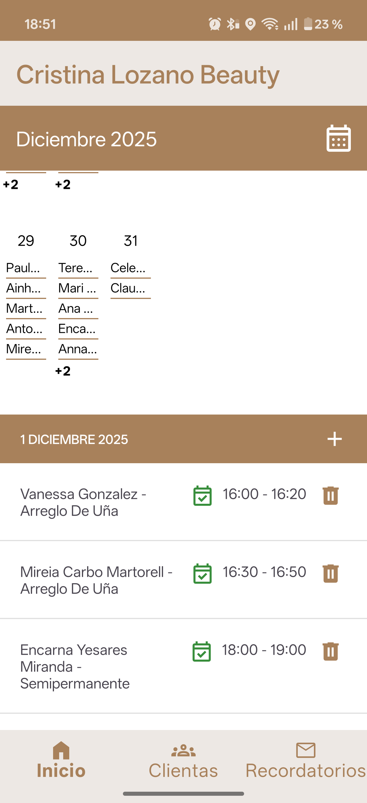
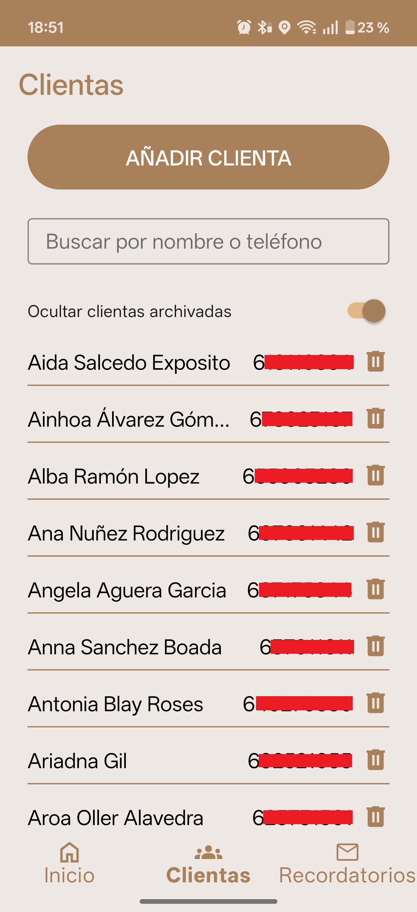
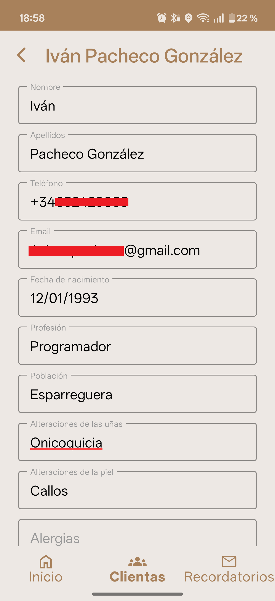
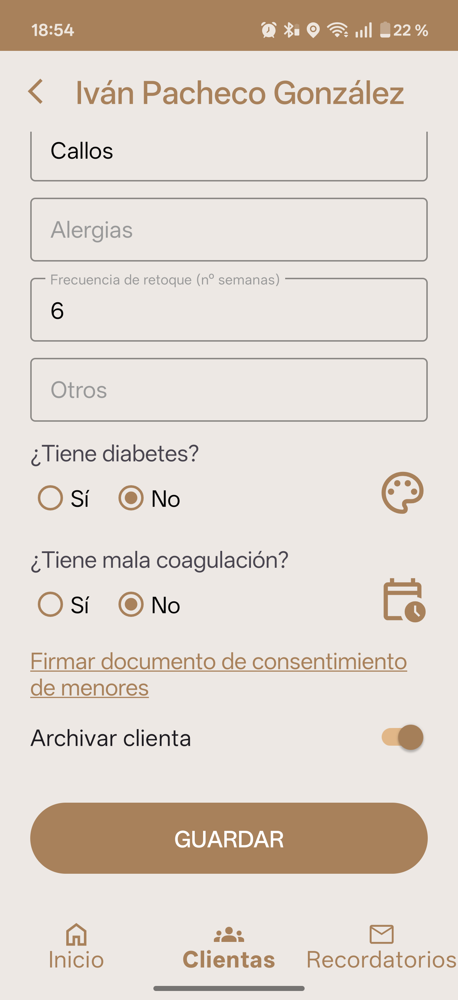
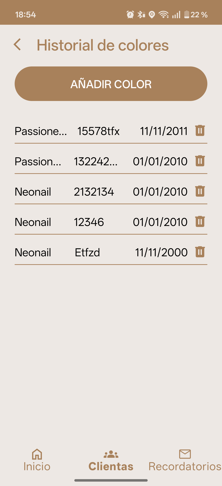
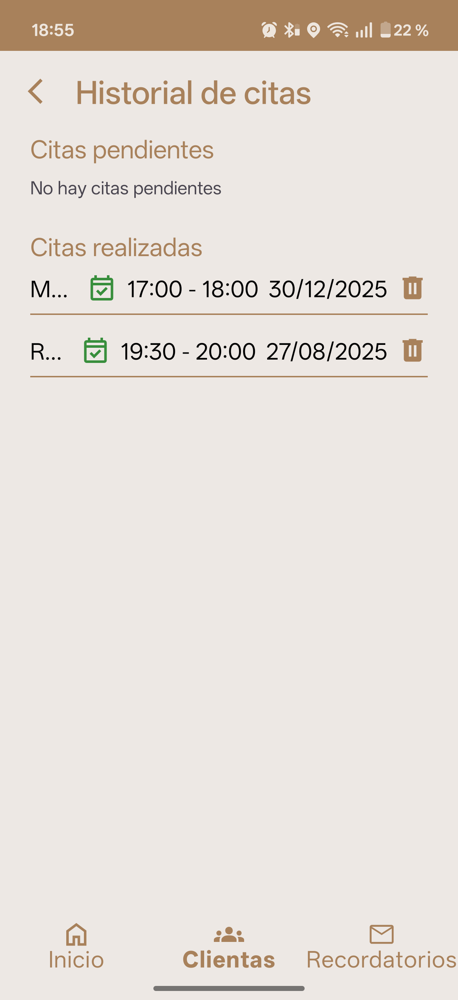

# Cristina Lozano Beauty
 
APP Android para el negocio de <a href="https://www.instagram.com/cristinalozano_beauty/">Cristina Lozano Beauty</a> 

  
 

  
 

 # Tecnologías y librerías utilizadas
 
· Desarrollado con lenguaje <b>KOTLIN</b> y flujos de threads con <b>RX</b> y <b>CORRUTINAS</b>.

 
· Arquitectura <b>HEXAGONAL</b>, <b>CLEAN ARCHITECTURE</b> y principios <b>SOLID</b> para una mejor estructuración y visualización del código.

 
· Autenticación con <b>FIREBASE AUTHENTICATION</b> y persistencia de datos con <b>FIRESTORE</b>.

 
· Inyección de dependencias con <b>DAGGER HILT</b>.

 
· Componentes UI creados con <b>MATERIAL</b>.

 
 # Servicios que ofrece
 
· Login a través de <b>GOOGLE</b> para sincronizar los eventos del calendario.

 
· Gestión de citas sincronizadas con <b>GOOGLE CALENDAR</b>.

 
· Gestión de clientas (CRUD) remoto con <b>FIREBASE FIRESTORE</b>.

 
· Recordatorios de las citas a las clientas a través de mensajería por Whatsapp.

 
· Historial de citas y esmaltes utilizados (colores).

 
· Firma de documento PDF y almacenamiento remoto con <b>FIREBASE STORAGE</b>.

 # Diseño de la APP
 
Aquí se muestran algunas de las pantallas de la APP.

 

  
  
  
  
  
  
  
  
 

